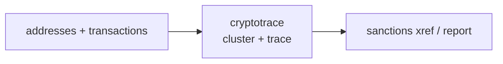

<a name="top"></a>
<div align="center">


# CRYPTOTRACE

### Free-tier blockchain investigator — ETH/BTC clustering + sanctions xref


[](https://pypi.org/project/cognis-cryptotrace/) [](https://github.com/cognis-digital/cryptotrace/actions) [](LICENSE) [](https://github.com/cognis-digital)

*OSINT / SIGINT — open-source intelligence collection and correlation.*

</div>

```bash
pip install cognis-cryptotrace
cryptotrace screen txs.json            # → prioritized findings in seconds
```

## Usage — step by step

1. **Install** the tool:

   ```bash
   pip install cognis-cryptotrace
   ```

2. **Screen a transaction list** (JSON/JSONL, or `-` for stdin) for OFAC sanctions hits, indirect exposure, and entity clusters:

   ```bash
   cryptotrace screen txs.json --max-hops 2
   ```

3. **Check a single address** or list the bundled OFAC SDN crypto addresses:

   ```bash
   cryptotrace check 1A1zP1eP5QGefi2DMPTfTL5SLmv7DivfNa
   cryptotrace sdn
   ```

4. **Read the result.** `screen` reports tx/address counts, clusters, sanctioned clusters, and findings by severity; add `--format json`, `--format sarif`, or `-o file`. Exit `1` when sanctioned exposure (critical/high/medium) is found, `0` otherwise. `cluster` groups addresses into single-entity wallets, `taint` propagates value-weighted dirty flow from SDN sources, and `peel` flags peeling-chain laundering.

5. **Gate / pipe.** Stream transactions in and act on the result:

   ```bash
   cat txs.jsonl | cryptotrace screen - --format json | jq '.max_severity'
   ```

## Contents

- [Why cryptotrace?](#why) · [Features](#features) · [Quick start](#quick-start) · [Live OFAC SDN feed](#feeds) · [Example](#example) · [Demos](#demos) · [Architecture](#architecture) · [AI stack](#ai-stack) · [How it compares](#how-it-compares) · [Integrations](#integrations) · [Install anywhere](#install-anywhere) · [Related](#related) · [Contributing](#contributing)

<a name="why"></a>
## Why cryptotrace?

Free-tier blockchain investigator — ETH/BTC clustering + sanctions xref — without standing up heavyweight infrastructure.

`cryptotrace` is single-purpose, scriptable, and self-hostable: point it at a target, get prioritized results in the format your workflow already speaks (table · JSON · SARIF), gate CI on it, and let agents drive it over MCP.

<div align="right"><a href="#top">↑ back to top</a></div>

<a name="features"></a>
## Features

- ✅ OFAC SDN screening (direct hits against bundled real SDN crypto wallets)
- ✅ **Live OFAC SDN ingestion** — refresh screening from the authoritative Treasury list, keyless, **offline / air-gap deployable**
- ✅ Indirect exposure by hop distance + **value-weighted taint propagation**
- ✅ Address clustering (common-input-ownership + change-address heuristics)
- ✅ Cluster sanctions inheritance + known-actor attribution + risk scoring
- ✅ Peeling-chain laundering-pattern detection
- ✅ Output as table · JSON · **SARIF 2.1.0** (code-scanning / CI)
- ✅ Runs on Linux/macOS/Windows · Docker · devcontainer · MCP-native
- ✅ Ports in Python, JavaScript, Go, and Rust (`ports/`)

<div align="right"><a href="#top">↑ back to top</a></div>

<a name="quick-start"></a>
## Quick start

```bash
pip install cognis-cryptotrace
cryptotrace --version
cryptotrace screen txs.json                  # OFAC + taint + clustering report
cryptotrace screen txs.json --format json    # machine-readable
cryptotrace screen txs.json --format sarif    # SARIF 2.1.0 for code-scanning
cryptotrace taint txs.json                    # value-weighted dirty-flow trace
cryptotrace peel txs.json                     # peeling-chain laundering pattern
cryptotrace check 0x722122df12d4e14e13ac3b6895a86e84145b6967   # single address
cryptotrace sdn                               # list bundled OFAC SDN addresses
cryptotrace feeds update ofac-sdn             # fetch the live OFAC SDN list
cryptotrace screen txs.json --feed            # screen against the LIVE SDN set
```

<div align="right"><a href="#top">↑ back to top</a></div>

<a name="feeds"></a>
## Live OFAC SDN feed — edge / air-gap deployable

The bundled SDN table is a curated seed. The `feeds` layer keeps the screen
**current** by ingesting the authoritative **US Treasury OFAC SDN list** and
merging every published *Digital Currency Address* into the screening index —
so addresses newly designated by OFAC (and absent from the seed) become
screenable.

**Real source** (keyless, no API key):

| Feed id | Source | URL |
|---|---|---|
| `ofac-sdn` | US Treasury OFAC Specially Designated Nationals list | `https://www.treasury.gov/ofac/downloads/sdn.csv` |

The ingestion engine ([`cryptotrace/datafeeds.py`](cryptotrace/datafeeds.py),
catalog [`cryptotrace/data_feeds_2026.json`](cryptotrace/data_feeds_2026.json))
is **standard-library only**: keyless HTTPS fetch → on-disk cache → re-serve.

```bash
cryptotrace feeds list                        # feeds wired into this tool
cryptotrace feeds update ofac-sdn             # fetch + cache (online, once)
cryptotrace feeds get ofac-sdn                # parse SDN crypto addresses
cryptotrace feeds get ofac-sdn --offline      # parse from cache, no network
cryptotrace screen txs.json --feed            # enrich screen with the live SDN set
cryptotrace check <addr> --feed --offline     # check against cached live SDN set
```

### Offline / air-gap workflow

Every read supports `--offline` (serve from cache, never touch the network).
The cache location is set with `COGNIS_FEEDS_CACHE`. To move the feed into a
disconnected enclave (sneakernet):

```bash
# on a connected host
cryptotrace feeds update ofac-sdn
python -m cryptotrace.datafeeds snapshot-export sdn.tar.gz

# carry sdn.tar.gz across the air gap, then inside the enclave:
python -m cryptotrace.datafeeds snapshot-import sdn.tar.gz
cryptotrace screen txs.json --feed --offline   # never reaches the network
```

See [`demos/09-ofac-feed-enrichment/`](demos/09-ofac-feed-enrichment/) for an
end-to-end offline walkthrough. The test suite exercises the whole path against
a committed trimmed fixture with the network blocked.

<div align="right"><a href="#top">↑ back to top</a></div>

<a name="example"></a>
## Example

```text
$ cryptotrace screen demos/01-tornado-cash-deposit/tx_graph.json
CRYPTOTRACE report  (ETH)
================================================================
Transactions analyzed : 4
Distinct addresses    : 5
Findings              : 5 (critical=1, high=3, medium=1)
Highest severity      : CRITICAL

Findings:
  [CRITICAL] ofac_direct_hit        0x722122df12d4e14e13ac3b6895a86e84145b6967  <Tornado Cash>
             Address on OFAC SDN list: Tornado Cash (mixer, program CYBER2, listed 2022-08-08).
  [HIGH    ] ofac_indirect_exposure 0x3333...  <1 hop(s)>
             1 hop(s) from a sanctioned address; 100.0% tainted (39.5000 ETH dirty value).
```

The same run as **SARIF 2.1.0** for GitHub/GitLab code-scanning:

```bash
cryptotrace screen tx_graph.json --format sarif -o cryptotrace.sarif
# → upload with github/codeql-action/upload-sarif@v3
```

<div align="right"><a href="#top">↑ back to top</a></div>

<a name="demos"></a>
## Demos — real investigation scenarios

Each folder under [`demos/`](demos/) is a self-contained, runnable scenario: a
transaction graph in the tool's real input format plus a `SCENARIO.md` that
explains where the data came from, the exact command, what to expect, and how
to act. Every demo is verified to actually produce its findings. Each uses a
**real, publicly-documented OFAC SDN address**; all other addresses are
fictional placeholders.

| Demo | Scenario | Exercises |
|---|---|---|
| [`01-tornado-cash-deposit`](demos/01-tornado-cash-deposit/) | Exchange screens a customer who routed ETH through Tornado Cash | direct hit · hop grading · taint |
| [`02-deep`](demos/02-deep/) | SUEX OTC layering over a BTC graph | direct + indirect + clustering |
| [`03-lazarus-bridge-exit`](demos/03-lazarus-bridge-exit/) | DPRK bridge-drain proceeds reach a Lazarus Group wallet | threat-actor attribution · fan-out taint |
| [`04-peel-chain-laundering`](demos/04-peel-chain-laundering/) | Funds peeled out of Hydra Market down a laundering chain | `peel` pattern detection |
| [`05-clean-treasury-baseline`](demos/05-clean-treasury-baseline/) | Clean DAO treasury — the negative control | exit 0 · no over-flagging |
| [`06-garantex-cashout`](demos/06-garantex-cashout/) | Fraud proceeds cashed out **into** the sanctioned Garantex exchange | sink-side / hop-distance exposure |
| [`07-cospend-cluster-taint`](demos/07-cospend-cluster-taint/) | Co-spend proves two wallets belong to a sanctioned entity | common-input clustering · sanctions inheritance |
| [`08-dprk-mixer-chain`](demos/08-dprk-mixer-chain/) | Two chained DPRK mixers (Blender.io → Sinbad.io) | multi-source taint |

```bash
python -m cryptotrace screen demos/01-tornado-cash-deposit/tx_graph.json
python -m cryptotrace peel   demos/04-peel-chain-laundering/tx_graph.json
python -m cryptotrace taint  demos/08-dprk-mixer-chain/tx_graph.json
```

<div align="right"><a href="#top">↑ back to top</a></div>

<a name="architecture"></a>
## Architecture



<div align="right"><a href="#top">↑ back to top</a></div>

<a name="ai-stack"></a>
## Use it from any AI stack

`cryptotrace` is interoperable with every popular way of using AI:

- **MCP server** — `cryptotrace mcp` (Claude Desktop, Cursor, Cognis.Studio, [uncensored-fleet](https://github.com/cognis-digital/uncensored-fleet))
- **OpenAI-compatible / JSON** — pipe `cryptotrace screen txs.json --format json` into any agent or LLM
- **LangChain · CrewAI · AutoGen · LlamaIndex** — wrap the CLI/JSON as a tool in one line
- **CI / scripts** — exit codes + SARIF for non-AI pipelines

<div align="right"><a href="#top">↑ back to top</a></div>

<a name="how-it-compares"></a>
## How it compares

| | **Cognis cryptotrace** | graphsense |
|---|:---:|:---:|
| Self-hostable, no account | ✅ | varies |
| Single command, zero config | ✅ | ⚠️ |
| JSON + SARIF for CI | ✅ | varies |
| MCP-native (AI agents) | ✅ | ❌ |
| Polyglot ports (JS/Go/Rust) | ✅ | ❌ |
| Open license | ✅ COCL | varies |

*Built in the spirit of **graphsense/graphsense-tagpacks**, re-framed the Cognis way. Missing a credit? Open a PR.*

<div align="right"><a href="#top">↑ back to top</a></div>

<a name="integrations"></a>
## Integrations

Pipes into your stack: **SARIF** for code-scanning, **JSON** for anything, an **MCP server** (`cryptotrace mcp`) for AI agents, and a webhook forwarder for SIEM/Slack/Jira. See [`docs/INTEGRATIONS.md`](docs/INTEGRATIONS.md).

<div align="right"><a href="#top">↑ back to top</a></div>

<a name="install-anywhere"></a>
## Install — every way, every platform

```bash
pip install "git+https://github.com/cognis-digital/cryptotrace.git"    # pip (works today)
pipx install "git+https://github.com/cognis-digital/cryptotrace.git"   # isolated CLI
uv tool install "git+https://github.com/cognis-digital/cryptotrace.git" # uv
pip install cognis-cryptotrace                                          # PyPI (when published)
docker run --rm ghcr.io/cognis-digital/cryptotrace:latest --help        # Docker
brew install cognis-digital/tap/cryptotrace                             # Homebrew tap
curl -fsSL https://raw.githubusercontent.com/cognis-digital/cryptotrace/main/install.sh | sh
```

| Linux | macOS | Windows | Docker | Cloud |
|---|---|---|---|---|
| `scripts/setup-linux.sh` | `scripts/setup-macos.sh` | `scripts/setup-windows.ps1` | `docker run ghcr.io/cognis-digital/cryptotrace` | [DEPLOY.md](docs/DEPLOY.md) (AWS/Azure/GCP/k8s) |

<div align="right"><a href="#top">↑ back to top</a></div>

<a name="related"></a>
## Related Cognis tools

- [`personagraph`](https://github.com/cognis-digital/personagraph) — Identity resolution dossier — username/email/phone cross-platform
- [`maritimeint`](https://github.com/cognis-digital/maritimeint) — AIS vessel tracking & sanctions-evasion anomaly detection
- [`geolens`](https://github.com/cognis-digital/geolens) — Image geolocation toolkit — EXIF, sun-shadow, OCR, reverse-search
- [`corpmap`](https://github.com/cognis-digital/corpmap) — Corporate structure & beneficial-ownership mapper
- [`darkmirror`](https://github.com/cognis-digital/darkmirror) — Surface-web mirror of public Tor leak-site index for brand monitoring

**Explore the suite →** [🗂️ all 170+ tools](https://github.com/cognis-digital/cognis-neural-suite) · [⭐ awesome-cognis](https://github.com/cognis-digital/awesome-cognis) · [🔗 cognis-sources](https://github.com/cognis-digital/cognis-sources) · [🤖 uncensored-fleet](https://github.com/cognis-digital/uncensored-fleet) · [🧠 engram](https://github.com/cognis-digital/engram)

<div align="right"><a href="#top">↑ back to top</a></div>

<a name="contributing"></a>
## Contributing

PRs, new rules, and demo scenarios are welcome under the collaboration-pull model — see [CONTRIBUTING.md](CONTRIBUTING.md) and [SECURITY.md](SECURITY.md).

> ### ⭐ If `cryptotrace` saved you time, **star it** — it genuinely helps others find it.

## Interoperability

`{}` composes with the 300+ tool Cognis suite — JSON in/out and a shared
OpenAI-compatible `/v1` backbone. See **[INTEROP.md](INTEROP.md)** for the
suite map, composition patterns, and reference stacks.

## License

Source-available under the **Cognis Open Collaboration License (COCL) v1.0** — free for personal, internal-evaluation, research, and educational use; **commercial / production use requires a license** (licensing@cognis.digital). See [LICENSE](LICENSE).

---

<div align="center"><sub><b><a href="https://cognis.digital">Cognis Digital</a></b> · one of 170+ tools in the <a href="https://github.com/cognis-digital/cognis-neural-suite">Cognis Neural Suite</a> · <i>Making Tomorrow Better Today</i></sub></div>
