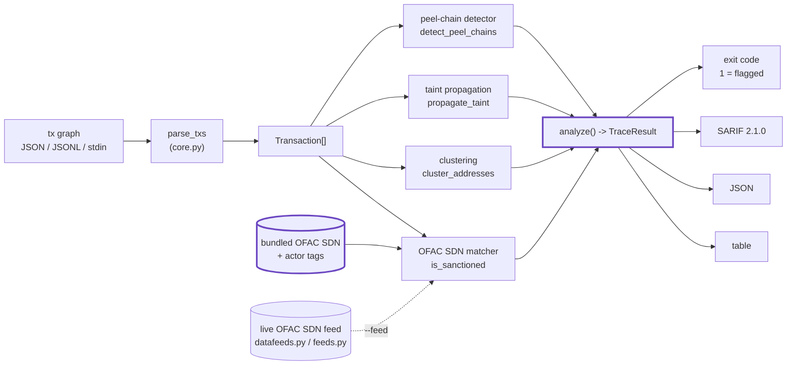
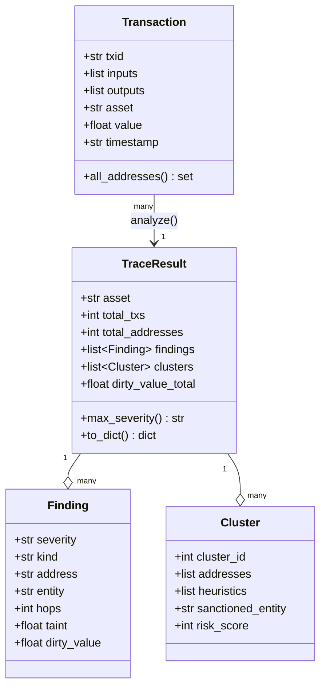

# Architecture

`cryptotrace` turns a transaction graph you already possess into a prioritized,
machine-readable forensics report — OFAC sanctions exposure, address clustering,
value-weighted taint, and laundering-pattern detection — with **no network and
the standard library only**. This document explains how the pieces fit together.

## The pipeline

## Components

### Parser (`cryptotrace/core.py: parse_txs`)
Accepts a JSON array, a `{"transactions": [...]}` object, or JSONL, and is
tolerant of explorer-style shapes: `inputs`/`from`/`vin`, `outputs`/`to`/`vout`,
and address fields nested as objects (`address`/`addr`/`prev_addr`/
`scriptpubkey_address`). It normalizes ETH addresses to lower-case and yields a
list of `Transaction` records that work for both UTXO (BTC) and account (ETH)
chains.

### OFAC SDN matcher (`is_sanctioned`, `actor_tag`, `ofac_entries`)
Screens every address against a bundled table of **real, publicly documented
OFAC SDN crypto wallets** (Lazarus/DPRK, Tornado Cash, Garantex, SUEX, Chatex,
Hydra, Blender.io, Sinbad.io, Bitzlato). The list is a curated seed; the live
feed layer (below) extends it. A separate known-actor table tags non-sanctioned
context (exchange/mixer/merchant) for triage.

### Clustering (`cluster_addresses`)
Groups addresses into single-entity wallets via two classic UTXO heuristics
merged through union-find: **common-input-ownership** (all inputs co-spent in one
tx share an owner) and **one-time change detection** (a lone fresh output is the
spender's change). Each cluster inherits the worst sanctions/actor tag of any
member and gets an aggregate 0–100 risk score.

### Taint propagation (`propagate_taint`)
Forward poison/haircut propagation from each sanctioned source: a source's spend
is 100% dirty, and dirty value is spread proportionally across outputs at every
hop. Each downstream address gets a taint **fraction** and an absolute
**dirty-value** amount — the value-weighted answer to "how exposed is this
wallet", not just a hop count.

### Peel-chain detector (`detect_peel_chains`)
Flags the classic layering pattern: a sequence of single-input/two-output txs
that each shed a small "peel" payment to a fresh address while forwarding the
larger change to the next hop.

### Top-level analysis (`analyze` -> `TraceResult`)
Runs all four layers and merges them into one severity-sorted `TraceResult`:
direct hits (critical), hop/taint exposure (high/medium), cluster inheritance
(high), and peel chains (medium). `TraceResult` renders to table, JSON, or
**SARIF 2.1.0** (`to_sarif`), and the CLI exits non-zero when any
critical/high/medium finding is present — the CI/compliance gate.

### Live OFAC SDN feed (`datafeeds.py`, `feeds.py`)
Keyless, standard-library HTTPS fetch of the authoritative US Treasury SDN list
→ on-disk cache → parse → merge into the screening index. Every read supports
`--offline` (serve from cache, never touch the network), and snapshots can be
exported/imported across an air gap.

## Data model

## Why these choices

- **No network, stdlib only.** The core never makes a chain call; you bring the
  tx export. The optional feed layer is the only thing that touches the network,
  and even that is `--offline`/air-gap deployable.
- **Deterministic and reproducible.** Every figure in a report is recomputable
  from the input file — the standard a SAR, a story, or a court exhibit needs.
- **Pipe-friendly by construction.** Table for humans, JSON for agents, SARIF
  for code-scanning, and an exit code for CI — the same run serves all four.
